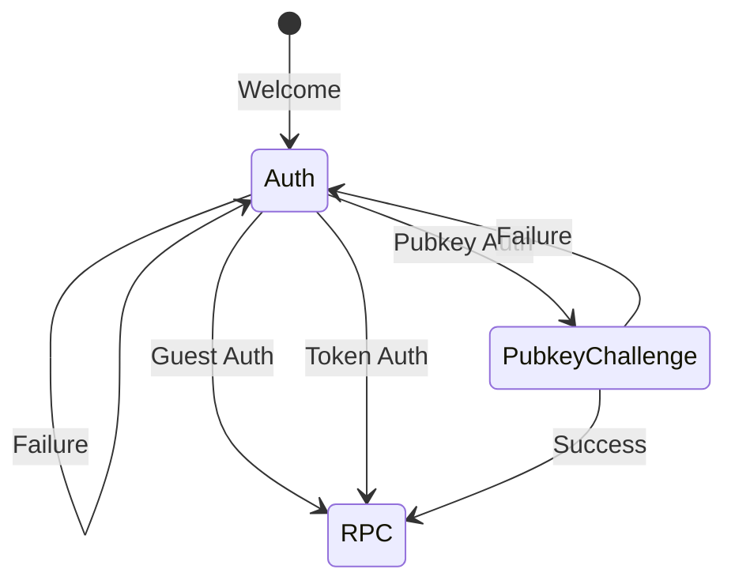
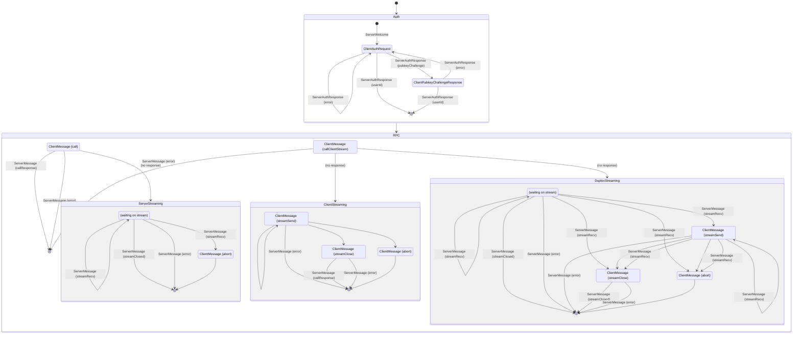

# 🧦 SockRPC

A straightforward, fast RPC protocol that's extremely similar to gRPC, but uses WebSockets instead of HTTP/2.

Define your service in a Protocol Buffers file, then generate SockRPC client and server definitions.

## Why SockRPC?

- Like gRPC, it's just protobuf: Define your whole API as a protobuf service
- Works in a browser without a proxy
- Supports all protobuf streaming types, including client and duplex streams
- Your socket is your session: authenticate only once, when opening a socket

## Authentication

SockRPC uses *stateful in-band authentication*: when a client opens a socket, the server, instead of reading HTTP headers, requests an auth handshake in the socket connection.

After a successful authentication process, the user ID (an arbitrary string) is saved on the socket connection, and is accessible on the server in every RPC call.

SockRPC supports 3 kinds of authentication:

### Guest Auth

The simplest kind: no credentials are provided, and the server assigns a user ID to the connection. Used if there are RPC calls that can be accessed without authentication.

### Token Auth

The client provides a binary token, and the server, if it accepts the token, returns a user ID. This can be used with session tokens, JWTs, etc.

### Pubkey Auth

The client provides an Ed25519 public key and a user ID. The server responds with a random challenge string, and the client responds to this challenge with a signature, which proves that the client owns the matching private key.

## Implementations

Currently there's only one, very incomplete, implementation in Typescript, based on [protobuf-ts](https://github.com/timostamm/protobuf-ts).

It depends on protobuf-ts's generic service feature. Yes, Google considers generic protobuf services deprecated, but several libraries support them anyway.

This project is a work in progress. Currently all 3 kinds of auth and 4 kinds of RPC work, but error codes aren't handled correctly yet.

## State Diagram

Here's a Mermaid state diagram of all of the client and server messages. I need to clean it up; it makes it look more complicated than it is.

## License

MIT license. Go nuts.